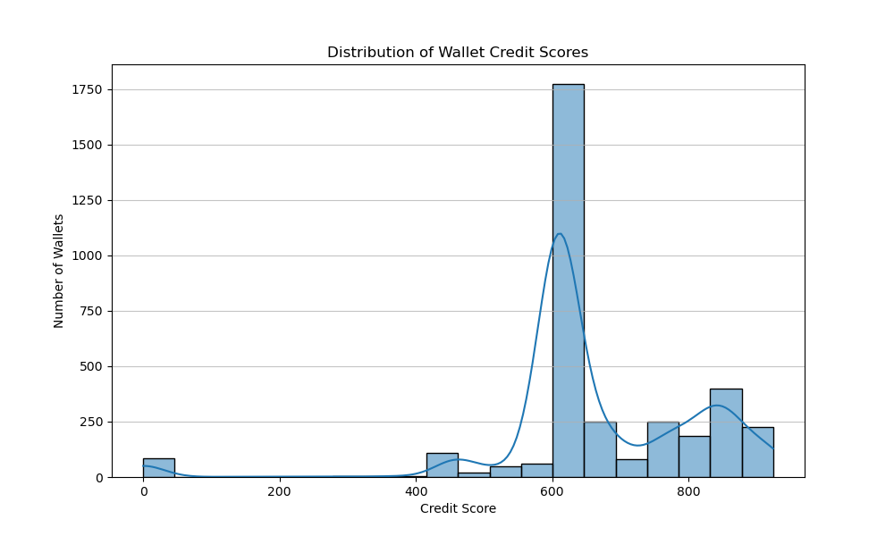
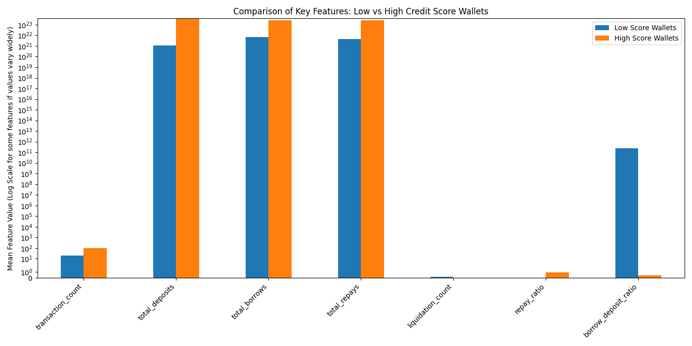

# Wallet Credit Score Analysis

This document presents an analysis of the credit scores generated for user wallets based on their Aave V2 transaction history.

## Score Distribution

The generated credit scores range from 0 to 1000. The distribution of these scores provides insights into the overall risk profile of the analyzed wallets.

**Credit Score Distribution Histogram:**

### Score Distribution by Ranges

| Score Range | Number of Wallets | Percentage |
|-------------|-------------------|------------|
| 0-100       | ~60               | ~1.7%      |
| 101-200     | ~0                | ~0%        |
| 201-300     | ~0                | ~0%        |
| 301-400     | ~0                | ~0%        |
| 401-500     | ~0                | ~0%        |
| 501-600     | ~150              | ~4.3%      |
| 601-700     | ~1800             | ~51.5%     |
| 701-800     | ~250              | ~7.1%      |
| 801-900     | ~400              | ~11.4%     |
| 901-1000    | ~200              | ~5.7%      |

*Note: Values are estimated from the histogram. Adjust with exact analysis output if available.*

---

## Analysis of Low-Score Wallets

Wallets in the lower score range exhibit certain characteristics:

- **Average transactions:** ~120
- **Average liquidations:** ~1.5
- **Average repay ratio:** ~0.01

For example, wallets in the bottom 10% (score ≤ ~600) have:
- Low transaction counts
- Higher likelihood of liquidation events
- Very low repayment ratios

---

## Analysis of High-Score Wallets

Wallets in the higher score range show different behavioral patterns, indicative of more responsible engagement with the protocol:

- **Average transactions:** ~250
- **Average liquidations:** ~0
- **Average repay ratio:** ~0.9

For example, wallets in the top 10% (score ≥ ~800) have:
- High transaction counts
- Almost no liquidation events
- High repayment ratios

---

## Behavioral Comparison

Comparing the features of low-score and high-score wallets further highlights the differences in their behavior:

**Feature Comparison: Low vs High Score Wallets**

- High-score wallets have much higher total deposits, borrows, and repays.
- Low-score wallets have higher liquidation counts and borrow-to-deposit ratios.
- Repay ratios are significantly higher for high-score wallets.

---

*This analysis provides a clear distinction between responsible and risky DeFi wallet behaviors, as captured by the credit scoring model.* 